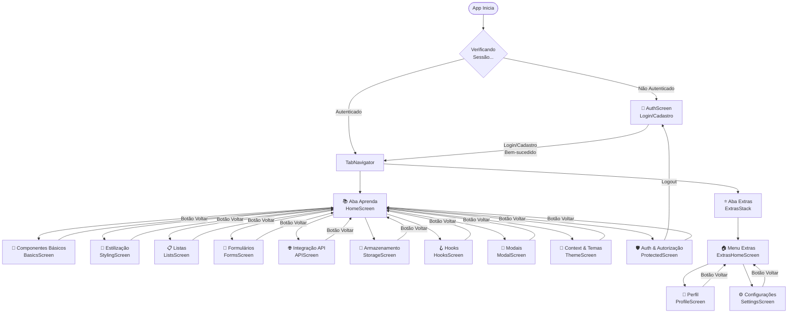

# 📱 POC React Native Learning Hub

Este é um projeto de aprendizado para React Native com Expo, cobrindo todos os conceitos essenciais para desenvolvimento mobile.

## 🚀 Como Executar

```bash
# Instalar dependências
npm install

# Iniciar o projeto
npx expo start

# Opções de execução:
# - Pressione 'a' para abrir no emulador Android
# - Pressione 'i' para abrir no simulador iOS
# - Escaneie o QR Code com o app Expo Go no seu celular
```

## 📁 Estrutura do Projeto

```
poc-learn-rn/
├── App.tsx                    # Ponto de entrada
├── src/
│   ├── navigation/           # Configuração de rotas
│   │   ├── Navigation.tsx      # Stack Navigator principal
│   │   └── TabNavigator.tsx    # Bottom Tabs + Extras Stack
│   ├── screens/              # Telas da aplicação
│   │   ├── HomeScreen.tsx       # Tela inicial
│   │   ├── BasicsScreen.tsx     # Componentes básicos
│   │   ├── StylingScreen.tsx    # Estilização
│   │   ├── ListsScreen.tsx      # FlatList, SectionList
│   │   ├── FormsScreen.tsx      # TextInput, validação
│   │   ├── APIScreen.tsx        # Integração com APIs
│   │   ├── StorageScreen.tsx    # AsyncStorage
│   │   ├── HooksScreen.tsx      # Hooks do React
│   │   ├── ModalScreen.tsx      # Modais e Bottom Sheets
│   │   ├── ThemeScreen.tsx      # Context API e Temas
│   │   ├── AuthScreen.tsx       # Login e Cadastro
│   │   ├── ProtectedScreen.tsx  # Exemplo de tela protegida
│   │   ├── ExtrasHomeScreen.tsx # Menu da aba Extras
│   │   ├── ProfileScreen.tsx    # Perfil do usuário
│   │   └── SettingsScreen.tsx   # Configurações do app
│   ├── contexts/             # Context API
│   │   ├── ThemeContext.tsx    # Tema global
│   │   └── AuthContext.tsx     # Autenticação global
│   └── types/                # Definições TypeScript
│       └── index.ts
├── assets/                   # Imagens, fontes, etc.
└── package.json
```

## 📚 Módulos de Aprendizado

### 1. 📱 Componentes Básicos (BasicsScreen)
- **View**: Container básico (equivalente a `<div>`)
- **Text**: Exibição de texto (todo texto DEVE estar em Text)
- **Image**: Exibição de imagens (requer width/height)
- **TouchableOpacity**: Botão com feedback de opacidade
- **Pressable**: Componente de toque moderno
- **ScrollView**: Container com scroll

### 2. 🎨 Estilização (StylingScreen)
- **StyleSheet.create()**: Forma otimizada de criar estilos
- **Flexbox**: Layout padrão (flexDirection: 'column' por padrão!)
- **Sombras**: Diferentes no iOS (shadow*) e Android (elevation)
- **Dimensões Responsivas**: useWindowDimensions()

### 3. 📋 Listas (ListsScreen)
- **FlatList**: Lista virtualizada (performática)
- **SectionList**: Lista com seções
- **Pull to Refresh**: RefreshControl
- **Infinite Scroll**: onEndReached

### 4. 📝 Formulários (FormsScreen)
- **TextInput**: Campo de entrada
- **KeyboardAvoidingView**: Evita que teclado cubra inputs
- **Validação**: Lógica de validação
- **keyboardType**: email-address, numeric, phone-pad

### 5. 🌐 Integração API (APIScreen)
- **Fetch API**: Mesma do navegador
- **Estados**: Loading, Error, Success
- **CRUD**: POST, PUT, PATCH, DELETE

### 6. 💾 Armazenamento (StorageScreen)
- **AsyncStorage**: Armazenamento key-value
- **JSON**: Serialização de objetos
- **CRUD Local**: Create, Read, Update, Delete

### 7. 🪝 Hooks (HooksScreen)
- **useState**: Estado local
- **useEffect**: Efeitos colaterais
- **useCallback**: Memorização de funções
- **useMemo**: Memorização de valores
- **useRef**: Referências mutáveis
- **Custom Hooks**: Hooks personalizados

### 8. 🔲 Modais (ModalScreen)
- **Modal Simples**: Modal básico com slide animation
- **Modal Transparente**: Overlay com backdrop escuro
- **Bottom Sheet**: Modal que sobe da parte inferior
- **Modal de Formulário**: Modal com inputs e ações

### 9. 🎨 Context API & Temas (ThemeScreen)
- **Context API**: Gerenciamento de estado global
- **Theme Provider**: Provider pattern para temas
- **useContext Hook**: Consumindo contexto
- **Theme Toggle**: Alternância entre light/dark
- **Imagens Locais vs Remotas**: require() vs URI

### 10. 📑 Tab Navigation (TabNavigator)
- **Bottom Tabs**: Navegação por abas na parte inferior
- **Tab Icons**: Ícones customizados para cada aba
- **Nested Navigation**: Stack Navigator dentro de Tab Navigator
- **Tab Customization**: Cores, estilos e badges

### 11. 🔐 Autenticação & Autorização (AuthScreen + ProtectedScreen)
- **Context API**: Estado global de autenticação
- **Login/Logout**: Fluxo completo de autenticação
- **Cadastro**: Criação de nova conta
- **Proteção de Rotas**: Navegação condicional
- **Persistência de Sessão**: AsyncStorage para manter login
- **Autorização (RBAC)**: Permissões baseadas em roles (admin vs user)
- **Auto-login**: Restauração automática de sessão
- **Validação de Formulários**: Email e senha

### 12. 👤 Perfil do Usuário (ProfileScreen)
- **Exibição de Dados**: Informações do usuário logado via Context
- **Modo de Edição**: Toggle entre visualização e edição
- **Avatar Placeholder**: Avatar baseado na inicial do nome
- **Formulários**: TextInput com diferentes tipos (text, phone-pad, textarea)
- **Campos Editáveis vs Não Editáveis**: Email bloqueado, nome editável
- **Confirmação de Ações**: Alert para salvar/cancelar alterações
- **Estatísticas**: Cards com informações visuais
- **Zona de Perigo**: Ações críticas (alterar senha, excluir conta)

### 13. ⚙️ Configurações (SettingsScreen)
- **Switch Components**: Toggles para ativar/desativar funcionalidades
- **Integração com Theme**: Tema escuro funcional via Context API
- **Seções Agrupadas**: Organização visual por categorias
- **Platform-specific UI**: Diferenças entre iOS e Android
- **Lista de Opções**: Navegação para sub-configurações
- **Informações do App**: Versão, build, termos de uso
- **Armazenamento**: Informações sobre cache e dados

### 14. 🏠 Menu Extras (ExtrasHomeScreen)
- **Nested Navigation**: Stack Navigator dentro de Tab Navigator
- **Cards de Navegação**: Menu visual para acessar recursos
- **User Info Card**: Exibição de dados do usuário logado
- **Layout Responsivo**: Cards com ícones e descrições
- **Demonstração de Navegação Aninhada**: Exemplo prático de estrutura complexa

---

## 🎯 Boas Práticas para React Native

### 📂 Organização de Pastas

```
src/
├── components/          # Componentes reutilizáveis
│   ├── common/         # Botões, Cards, Inputs genéricos
│   └── specific/       # Componentes específicos de features
├── screens/            # Telas/páginas
├── navigation/         # Configuração de rotas
├── hooks/              # Hooks customizados
├── services/           # Chamadas de API
├── stores/             # Estado global (Redux, Zustand, etc.)
├── utils/              # Funções utilitárias
├── constants/          # Constantes, cores, dimensões
├── types/              # Tipos TypeScript
└── assets/             # Imagens, fontes
```

### ⚡ Performance

1. **Use FlatList** ao invés de ScrollView + map() para listas grandes
2. **Memorize** callbacks com useCallback quando passados para componentes filhos
3. **Use React.memo()** para componentes que não precisam re-renderizar
4. **Evite** criar objetos/arrays inline em props de componentes
5. **Use useMemo()** para cálculos pesados

```tsx
// ❌ Ruim - cria novo objeto a cada render
<View style={{ padding: 10 }} />

// ✅ Bom - usa StyleSheet
<View style={styles.container} />

// ❌ Ruim - recria função a cada render
<Button onPress={() => handlePress(id)} />

// ✅ Bom - função memorizada
const handleButtonPress = useCallback(() => {
  handlePress(id);
}, [id]);
<Button onPress={handleButtonPress} />
```

### 📱 Responsividade

```tsx
import { useWindowDimensions, Platform } from 'react-native';

function MyComponent() {
  const { width, height } = useWindowDimensions();
  const isLandscape = width > height;
  
  return (
    <View style={[
      styles.container,
      { width: width * 0.9 },  // 90% da tela
      isLandscape && styles.landscape
    ]}>
      {/* ... */}
    </View>
  );
}

// Valores específicos por plataforma
const styles = StyleSheet.create({
  container: {
    paddingTop: Platform.select({
      ios: 20,
      android: 16,
      default: 12,
    }),
  },
});
```

### 🔐 Segurança

1. **Nunca armazene** dados sensíveis em AsyncStorage
2. **Use expo-secure-store** para tokens e senhas
3. **Valide** todas as entradas do usuário
4. **Não exponha** chaves de API no código

```tsx
// Para dados sensíveis, use expo-secure-store
import * as SecureStore from 'expo-secure-store';

await SecureStore.setItemAsync('token', userToken);
const token = await SecureStore.getItemAsync('token');
```

### 🧭 Navegação

```tsx
// Tipagem completa para navegação
type RootStackParamList = {
  Home: undefined;
  Details: { id: number; title: string };
  Profile: { userId: string };
};

// Usando com tipagem
type DetailsScreenProps = NativeStackScreenProps<RootStackParamList, 'Details'>;

function DetailsScreen({ route, navigation }: DetailsScreenProps) {
  const { id, title } = route.params;
  // ...
}
```

### 🎨 Estilização

```tsx
// Prefira StyleSheet.create para melhor performance
const styles = StyleSheet.create({
  container: {
    flex: 1,
    padding: 16,
  },
});

// Sombras cross-platform
const shadow = {
  // iOS
  shadowColor: '#000',
  shadowOffset: { width: 0, height: 2 },
  shadowOpacity: 0.25,
  shadowRadius: 3.84,
  // Android
  elevation: 5,
};

// Cores consistentes - crie um arquivo de constantes
export const COLORS = {
  primary: '#3498db',
  secondary: '#2ecc71',
  error: '#e74c3c',
  text: '#2c3e50',
  textLight: '#7f8c8d',
  background: '#f5f6fa',
};
```

### 🧪 Debugging

```tsx
// Console logs aparecem no terminal do Metro
console.log('Debug:', data);

// Para objetos complexos
console.log(JSON.stringify(data, null, 2));

// React Native Debugger ou Flipper para debugging avançado

// Layout debugging - adicione bordas temporariamente
const debugStyle = { borderWidth: 1, borderColor: 'red' };
```

---

## � Testando o Fluxo de Autenticação

### Credenciais de Demonstração

A POC possui dois usuários mockados para teste:

**Usuário Admin:**
- Email: `daniel@example.com`
- Senha: `123456`
- Role: `admin`

**Usuário Comum:**
- Email: `joao@example.com`
- Senha: `123456`
- Role: `user`

### Fluxo de Teste

1. **Primeira Execução (Sem Login)**
   - Ao abrir o app, você verá a tela de login (AuthScreen)
   - Nenhuma tela do app estará acessível

2. **Fazer Login**
   - Use as credenciais acima ou crie uma nova conta
   - Após login bem-sucedido, você será redirecionado automaticamente para o app
   - A sessão é salva no AsyncStorage

3. **Navegar pelo App Autenticado**
   - Acesse todos os módulos de aprendizado
   - Entre na tela "🛡️ Autenticação & Autorização" para ver os dados do usuário

4. **Testar Autorização (Roles)**
   - Na tela protegida, teste a ação de admin
   - Com usuário admin: Ação é executada
   - Com usuário comum: Acesso negado

5. **Fazer Logout**
   - Na tela protegida, clique em "Sair"
   - Você voltará para a tela de login
   - A sessão é removida do AsyncStorage

6. **Testar Auto-Login**
   - Feche o app completamente
   - Reabra o app
   - Você deve ser automaticamente redirecionado para o app (sem precisar fazer login novamente)

---
## 🗺️ Fluxo de Navegação Completo

### Diagrama Visual



### 🚀 Ao Abrir o App

**1. App.tsx inicia** → Carrega os Providers (SafeArea, Auth, Theme)

**2. AuthContext verifica sessão**
- Busca no AsyncStorage se existe usuário/token salvo
- **Loading de ~1 segundo** (mostra spinner)

**3. Navigation.tsx decide a rota inicial:**

#### ❌ Cenário A: NÃO AUTENTICADO
```
App → AuthScreen (Tela de Login/Cadastro)
```
- **Primeira tela visível**: Formulário de login
- **Opções**:
  - Fazer login → Vai para TabNavigator
  - Trocar para cadastro → Mesmo AuthScreen, modo diferente
  - Preencher demo → Auto-completa campos

#### ✅ Cenário B: AUTENTICADO (ou após login)
```
App → TabNavigator → Aba "Aprenda" (HomeScreen)
```
- **Primeira tela visível**: HomeScreen com 10 cards de módulos
- **Bottom tabs visíveis**: 
  - 📚 Aprenda (ativa)
  - ⭐ Extras

### 🏠 Navegação Principal (HomeScreen)

**HomeScreen** - Tela com ScrollView contendo 10 cards:

| Card | Ao Clicar | Navega para |
|------|-----------|-------------|
| 📱 Componentes Básicos | `navigation.navigate('Basics')` | BasicsScreen |
| 🎨 Estilização | `navigation.navigate('Styling')` | StylingScreen |
| 📋 Listas & Performance | `navigation.navigate('Lists')` | ListsScreen |
| 📝 Formulários | `navigation.navigate('Forms')` | FormsScreen |
| 🌐 Integração API | `navigation.navigate('API')` | APIScreen |
| 💾 Armazenamento | `navigation.navigate('Storage')` | StorageScreen |
| 🪝 Hooks Essenciais | `navigation.navigate('Hooks')` | HooksScreen |
| 🔲 Modais | `navigation.navigate('Modal')` | ModalScreen |
| 🎨 Context API & Temas | `navigation.navigate('Theme')` | ThemeScreen |
| 🛡️ Autenticação & Autorização | `navigation.navigate('Protected')` | ProtectedScreen |

### 🔄 Dentro de Cada Tela de Módulo

**Todas as telas de módulo têm:**

1. **Header com botão voltar** (← no topo)
   - Clica no voltar → Volta para HomeScreen
   - Gesto de swipe (iOS) → Volta para HomeScreen

2. **ScrollView com conteúdo**
   - Explicações teóricas
   - Exemplos práticos interativos
   - Código comentado

### 📑 Tab Navigation (Bottom Tabs)

**Sempre visíveis após autenticação:**

#### 📚 Aba "Aprenda"
- Componente: **HomeScreen**
- Conteúdo: 10 cards de módulos
- Ao tocar: Abre módulo correspondente

#### ⭐ Aba "Extras"
- Componente: **ExtrasStackNavigator** (Stack aninhado)
- Conteúdo: Menu com 2 opções + navegação para sub-telas
- **Finalidade**: Demonstrar navegação aninhada (Stack dentro de Tab)
- **Telas**:
  - **ExtrasHomeScreen**: Menu principal com cards
  - **ProfileScreen**: Perfil do usuário com edição
  - **SettingsScreen**: Configurações do app

**Troca entre abas:**
- Toque na aba desejada
- Estado de cada aba é preservado (ao voltar, está no mesmo lugar)

### 🔐 Fluxo de Autenticação Detalhado

#### Login/Cadastro (AuthScreen)

**1. Modo Login (padrão):**
```
Preenche email + senha → Clica "Entrar"
  ↓
Valida campos → Chama signIn()
  ↓
Salva no AsyncStorage → Atualiza estado global
  ↓
Navigation detecta isAuthenticated=true
  ↓
Redireciona automaticamente para TabNavigator (HomeScreen)
```

**2. Modo Cadastro:**
```
Clica "Cadastre-se" → Muda para modo signup
  ↓
Preenche nome + email + senha → Clica "Cadastrar"
  ↓
Valida campos → Chama signUp()
  ↓
Cria usuário → Salva no AsyncStorage
  ↓
Redireciona automaticamente para TabNavigator
```

#### Logout (ProtectedScreen)

```
Na tela "🛡️ Auth & Autorização" → Clica "🚪 Sair"
  ↓
Alert de confirmação → Clica "Sair"
  ↓
signOut() remove AsyncStorage
  ↓
Navigation detecta isAuthenticated=false
  ↓
Redireciona automaticamente para AuthScreen
```

### 🔄 Auto-Login

**Ao abrir o app novamente:**

```
App inicia → AuthContext.useEffect()
  ↓
Busca AsyncStorage por token/user
  ↓
Se encontrou → setUser(userData) + setLoading(false)
  ↓
Navigation vê isAuthenticated=true
  ↓
Vai direto para TabNavigator (não mostra login)
```

### 📊 Stack de Navegação (Estrutura Técnica)

```
NavigationContainer
├── Stack Navigator (Root)
│   │
│   ├── [NÃO AUTENTICADO]
│   │   └── Auth (AuthScreen)
│   │
│   └── [AUTENTICADO]
│       ├── Home (TabNavigator)
│       │   ├── Tab: Aprenda (HomeScreen)
│       │   └── Tab: Extras (ExtrasStack) ← NESTED NAVIGATION
│       │       ├── ExtrasHome (ExtrasHomeScreen)
│       │       ├── Profile (ProfileScreen)
│       │       └── Settings (SettingsScreen)
│       │
│       ├── Basics (BasicsScreen)
│       ├── Styling (StylingScreen)
│       ├── Lists (ListsScreen)
│       ├── Forms (FormsScreen)
│       ├── API (APIScreen)
│       ├── Storage (StorageScreen)
│       ├── Hooks (HooksScreen)
│       ├── Modal (ModalScreen)
│       ├── Theme (ThemeScreen)
│       └── Protected (ProtectedScreen)
```

### 🎯 Resumo: Fluxo Típico de Uso

**Primeira vez usando o app:**
```
1. Abre app → Loading (1s) → AuthScreen
2. Faz login → HomeScreen (aba Aprenda)
3. Clica "📱 Componentes Básicos" → BasicsScreen
4. Lê conteúdo, desliza para voltar → HomeScreen
5. Clica "🎨 Estilização" → StylingScreen
6. Clica voltar no header → HomeScreen
7. Toca aba "⭐ Extras" → ExtrasHomeScreen
8. Clica card "👤 Meu Perfil" → ProfileScreen
9. Clica "✏️ Editar" → Edita campos → Clica "Salvar"
10. Volta para ExtrasHome → Clica "⚙️ Configurações" → SettingsScreen
11. Ativa toggle "Tema Escuro" → App muda para dark mode
12. Toca aba "📚 Aprenda" → HomeScreen
13. Clica "🛡️ Auth" → ProtectedScreen
14. Clica "Sair" → Confirma → AuthScreen
```

**Reabre app (com sessão salva):**
```
1. Abre app → Loading (1s) → HomeScreen (auto-login!)
2. Continua navegando normalmente
```

### 💡 Dicas de Navegação

**Voltar para HomeScreen de qualquer tela:**
- Toque no botão "←" no header
- Ou deslize da borda esquerda (iOS)

**Ver todas as telas:**
- Sempre volte para HomeScreen (aba Aprenda)
- Lá estão os 10 cards para acessar tudo

**Trocar de usuário:**
- Vá em "🛡️ Auth & Autorização"
- Faça logout
- Faça login com outro email

**Testar auto-login:**
- Feche o app completamente (force quit)
- Reabra → Deve ir direto para HomeScreen

---
## �📦 Bibliotecas Recomendadas

### Navegação
- **@react-navigation/native** - Navegação principal
- **@react-navigation/native-stack** - Stack navigator nativo
- **@react-navigation/bottom-tabs** - Tab bar inferior

### Estado Global
- **zustand** - Simples e performático
- **@tanstack/react-query** - Para estado de servidor/cache
- **redux-toolkit** - Para apps maiores

### UI
- **react-native-paper** - Material Design
- **native-base** - Componentes multiplataforma
- **tamagui** - UI moderna e performática

### Formulários
- **react-hook-form** - Formulários performáticos
- **yup** ou **zod** - Validação de schema

### Storage
- **@react-native-async-storage/async-storage** - Key-value storage
- **expo-secure-store** - Dados sensíveis
- **expo-sqlite** - Banco de dados local

### Autenticação & Segurança
- **expo-secure-store** - Armazenamento seguro de tokens (criptografado)
- **expo-local-authentication** - Biometria (Face ID, Touch ID)
- **jwt-decode** - Decodificar tokens JWT
- **react-native-keychain** - Armazenamento seguro nativo
- **@react-native-firebase/auth** - Firebase Authentication
- **axios** - Interceptors para adicionar tokens automaticamente

### Utilitários
- **date-fns** - Manipulação de datas
- **axios** - HTTP client (alternativa ao fetch)

---

## 🔗 Recursos Úteis

- [Documentação React Native](https://reactnative.dev/docs/getting-started)
- [Documentação Expo](https://docs.expo.dev/)
- [React Navigation](https://reactnavigation.org/docs/getting-started)
- [React Native Directory](https://reactnative.directory/) - Busca de bibliotecas

---

## 🎓 Próximos Passos

1. **Explore cada tela** do app para ver os exemplos funcionando
2. **Leia os comentários** no código - cada arquivo está bem documentado
3. **Experimente modificar** os exemplos para fixar o aprendizado
4. **Implemente algo próprio** usando os padrões aprendidos

Boa sorte no seu novo projeto! 🚀
